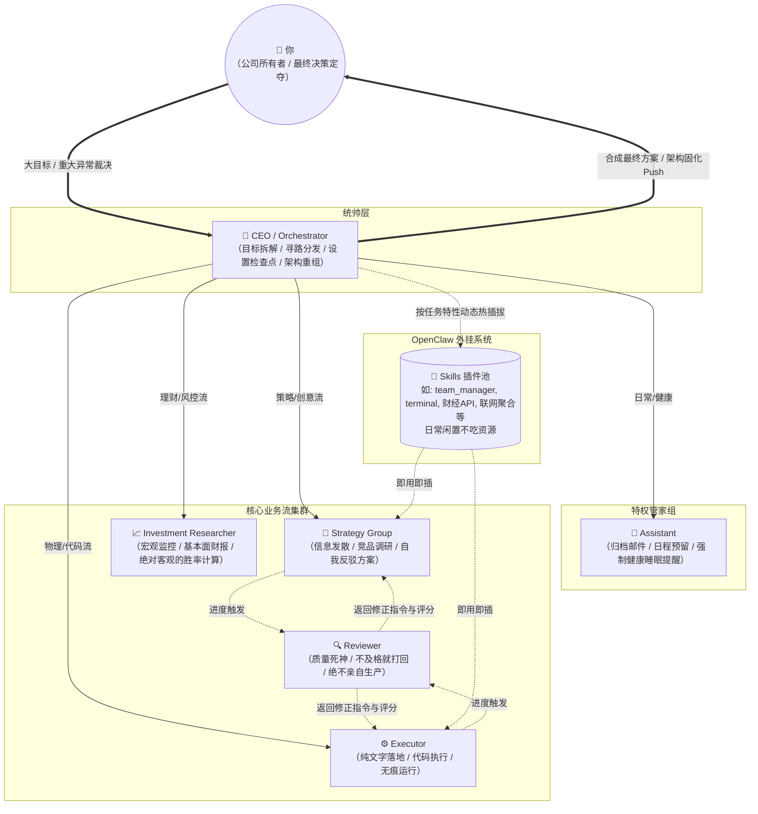

# 一人公司 AI Team - 架构与自治部署体系 (基于 OpenClaw)

这个代码仓库包含了完全由 Markdown 定义的“多智能体团队架构”。在此模式下，我们摒弃了传统的人工脚本自动化（如运行一个 .sh 脚本），而是**直接赋予数字 CEO 一项原生的团队管理技能 (`team_manager`)，让 AI 自己去 GitHub 拉取组织架构并完成旗下团队的分发与更迭。**

---

## 👥 人类阅读：Team 设计架构与协作工作流 (Human-Readable Workflow)

这个仓库不仅是给 CEO Agent 看的架构图，也是属于你的“公司人事简章”。整个“一人公司”的团队运转遵循**“分层混合模式”**，确保任务流转清晰、极度解耦，且不会发生无穷尽的 AI 幻觉沟通循环。

### 1. 角色组成 (Who is who)
- **👑 CEO / Orchestrator (战略大脑)**
  - **职责**：整个团队唯一直接向“你(User)”做最终汇报的接口。负责接收你的大目标，拆解成 MECE 任务树，分发给下属，并在关键进度（30%、70%、100%）点设置质量检查点。
  - **特权**：唯独它拥有 `team_manager` 技能权限，可以根据本 GitHub 仓库的蓝图直接利用 OpenClaw 原生系统招募、更新或同步其他员工参数，确保 OpenClaw 主表（openclaw.json）完全承认这些特工的合法性。
- **💼 Assistant (超级秘书)**
  - **职责**：接管“琐碎但必须要做”的事务，整理邮件、规整 Notion；兼顾你的私人健康助理，强制提醒你喝水并在日历预留休息时间。
- **🧠 Strategy Group (战略组 / 研究创意复合体)**
  - **职责**：面对业务课题，实行“先研究宏观与竞品 -> 再创意发散 -> 内部自我反驳”的闭环，产出自带多种策略包格式的简报。
- **📈 Investment Researcher (独立投研分析师)**
  - **职责**：华尔街级别的量化+基本面分析。追踪财报与宏观数据（如美联储FOMC），区分市场情绪与确切事实。他只负责计算胜率/盈亏比和做核心风险提示，**绝不代你直接点下真实交易按钮**。
- **⚙️ Executor (执行狂魔)**
  - **职责**：只负责代码和物理落地（发推、上线网页）。自身有着“不留痕代码洁癖”，所有扩展技能从 CEO 处领用，用完即卸载，保持运行环境绝对纯洁。
- **🔍 Reviewer (三层审计官)**
  - **职责**：质量死神，眼底只有及格(1)和不及格(0)。他不常驻监控窃听，只有被 CEO 唤醒到“里程碑预检、半程巡检、全量验收”时才出面，如果产物偏离《GLOBAL_SOUL.md》规则，会立刻扔出带评分的修正指令打回重做。

### 2. 标准协作工作流演示 (How they work)
**【示例场景】：“做个针对学生群体的 AI 笔记落地页并规划市场推广”**
1. **你对 CEO 下令**：“我想做一个这样的落地页，你安排去办。”
2. **CEO 拆解立项**：CEO 划分任务。把受众调研与文案发给 `Strategy Group`，把代码需求发给 `Executor`，并立下 30%、70%、交付时的审查检查点。
3. **并行干活与审查**：
   - `Strategy Group` 调研完拿出首版文案。到达检查点，CEO 唤醒 `Reviewer` 查看。`Reviewer` 认为文案语气不够符合核心价值，打 85 分并提供调整建议，文案打回。迭代后再次提交，通过。
   - `Executor` 拿到定稿文案开始切图和写 Next.js 代码。页面完成后触发最终验收，`Reviewer` 跑完性能检查和安全确认，通过。
4. **最终交付与报告**：CEO 收拢所有 100% 跑通的组件，合成最终的上线链接、A/B 营销推文包发送给你。涉及到方向性抉择（如：今天推发情感版还是效率版文案），CEO 会暂停所有执行流，等待你的“一锤定音”。

---

## 🚀 核心运作流：一次设“种”，全量生长

在首次部署、部署到云服务器或跨设备换机时，你**只需要手动唤醒一位“种子员工”—— 即你的 CEO**。接下来的所有环境初始化与员工招募（创建其他 Agent），全部通过你与 CEO 的直接自然语言对话自动完成。

### 第一步：播下种子（首次配置并唤醒 CEO）
由于系统环境往往默认空无一物，你需要依靠 OpenClaw 首先把“CEO”这位统帅创建起来，并将“人员招募技能”授予他。

1. 在终端执行命令行或通过应用界面，初始化出这个核心身份：
   ```bash
   # 具体命令依 OpenClaw 实现为准
   openclaw agents add ceo_orchestrator
   ```
2. 将你当前看到的本仓库（核心架构图）克隆或下载到本地。
3. 给这个 CEO 挂载本仓库里的 `agents/ceo.md` 作为他的性格配置。最关键的是——**指示系统为其强绑定 `skills/team_manager/` 这个包含了 Python 底层调度代码的超级技能包。**

### 第二步：指令即部署（命令 CEO 组建公司）
配置好 CEO 并进入其对话界面后，直接用自然语言向它发号施令：

> **“你好老板！我是这个一人公司的最终宿主。请运用你的 `team_manager` 团队管理技能，拉取我们 GitHub 上最新的架构，按要求把 Assistant、独立投研分析师等岗位的员工装配好并唤醒入职。”**

**此时，CEO 收到指令后会自动在后台完成以下动作：**
1. 调用下挂的 `sync_team.py` 执行 `git pull` 以确保本地拥有的剧本是最新的。
2. 内部扫描架构仓 `agents/` 下所有的预设职位。
3. 像真实 CTO 一样，CEO 会优先在底层的注记册（`openclaw.json`）里检查该员工。如果没有，它会自动执行官方 CLI 命令 `openclaw agents add <agent_id>` 以此生成引擎认定的标准化 Workspace 文件夹（例如 `~/.openclaw/workspace-assistant`），这里面将自动生成原厂的初始 Markdown。
4. 随后，它将提取咱们 GitHub 上的全公司统管底线（`GLOBAL_SOUL.md`）和对应岗位的详细 MD 内容，精准打断并**合规覆盖**进这名原生生成员工的 `IDENTITY.md` 以及 `SOUL.md`。至于记忆或者无用的系统自生文件（如 `BOOTSTRAP.md`）则任由系统自我接管，完全顺应了 OpenClaw 的生命周期！
5. 操作完成，CEO 将回复确认报告：“系统部署完成，各核心环节全部就绪，等待下发任务。”

---

## 🔄 随时更替：架构的双向自动化同步

有了团队后，“迭代”也会变得非常有意思。架构设计的生死修改同样完全被封装在了对话里：

### 场景 A：云端架构更新（人类修改了公司章程）
当你在外用手机或在线直接编辑了 GitHub 上的 `strategy_group.md`（譬如你想更换模型为最新出的大模型，或者调整它的提示词），只需要保存到 GitHub（Git Push 后）。
当你回到家里打开引擎环境，不用去弄环境设置，直接对 CEO 说：
> **“公司架构文档有更新，请用你的能力帮我重调一次底层设定同步给全团队大家。”**

CEO 就会再次运用该技能触发 `pull_and_sync`，在不动员工原有长期记忆的前提下，把新的思想覆写写入引擎。

### 场景 B：运行时自我进化固化（备份团队经验）
因为 AI 带记忆能形成长期知识库。如果有一天 CEO 在处理棘手方案后形成了一份团队极佳的“协同经验准则”，或者你直接通过引擎可视化界面调整了一个细微参数，你想要把它长久存进你的中央架构库以防丢失。
这时候你可以对 CEO 讲：
> **“当前团队磨合得非常完美，请将目前底层最新的沙盒状态参数提取出规则重构回文档，并给我 Push 备份到我们的 GitHub 仓库作为主设定覆盖。”**

CEO 就会触发它的工具链二 `export_team_state` 逆向完成反解构重装的工作，提交一次 `git commit`。你甚至连 `git push` 的命令行都不需要自己敲。（*附：运行需确保设备配置好了 SSH 免密/Token*）

---

### 原创设计理念
这种用 OpenClaw CLI 并融合了 `team_manager` 的设计，真正做到了将**“抽象代码设定”**与**“AI 具身人格”**的优雅融合。人类决策者将能完全抽身繁杂的系统操作命令：**招人、炒人、立规矩，你只管张嘴提要求，让你的赛博 CEO 去当那个干脏活累活的底层监工吧！**

---

## 🗺️ 架构拓扑图 (Architecture Map)

下面是一人公司 AI 团队流转的**最高视觉全景图**（支持在 GitHub 原生渲染展示）：


